<div align="center">



</div>

---

# ⚡ System Check

```text
AI CORE ............... ONLINE
SECURITY .............. VERIFIED
AUTOMATION ............ ACTIVE
LOCAL MODELS .......... READY
SYSTEM STATUS ......... OPERATIONAL
```

---

# 👤 System Identity

```yaml
USER:
  Thomas Cottle

HANDLE:
  bin4ryh4Kr

LOCATION:
https://tcottledesigns.com

ROLE:
  • AI Builder
  • Full Stack Developer
  • Security Researcher
  • Reverse Engineer

MISSION:
  Build intelligent software.  
  Automate everything.
  Never stop learning.
```

---

# ⚙️ Arsenal

<div align="center">


</div>

---

# 🤖 AI Core

```text
GPT .............. CONNECTED
Claude ........... CONNECTED
Ollama ........... ONLINE
Qwen ............. LOADED
Mistral .......... READY

MCP .............. CONNECTED
Agents ........... ACTIVE
```

---

# 🛡 Cyber Lab

```text
~/lab

reverse-engineering/
security/
automation/
web/
ai/
```

---

# 🚀 Current Missions

```text
[█████████░] TCOTTLE WEB DESIGNS

[███████░░░] TCOTTLE.OS

[██████░░░░] SECURITY LAB

[█████░░░░░] AI COMMAND CENTER
```

---

# 📡 Final Transmission

```text
127.0.0.1

There's No Place Like Home.

Build.
Break.
Learn.
Repeat.

SYSTEM READY_
```